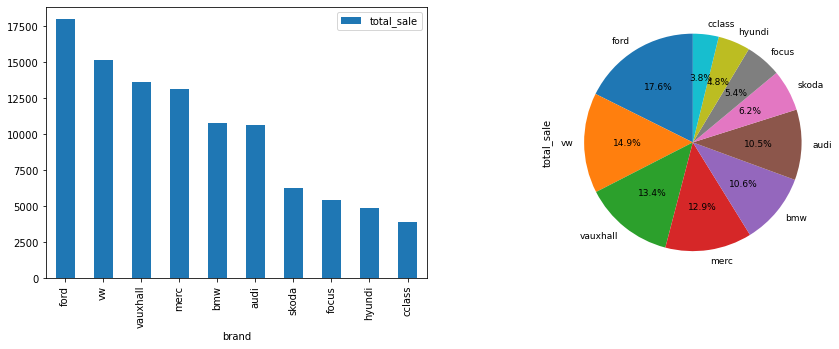
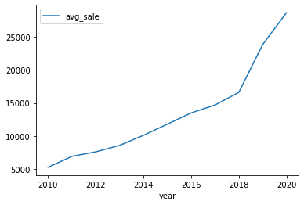
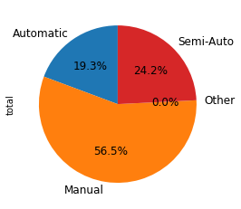
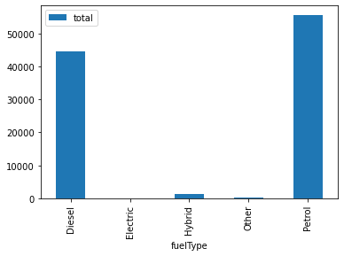
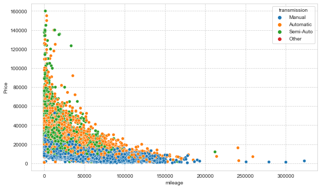
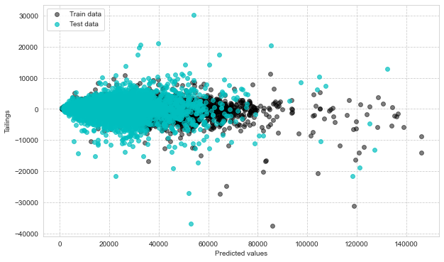

```python
#Decriptions: This project is aimed to discover UK used cars data sets gatherd from kaggle
# It contains 2 part:
#Part 1: EDA and Visualization
#Part 2: Prediction model with 96% scores by Random Forest Regression
```


```python
#Import libraries
import numpy as np 
import pandas as pd
import sqlite3 as sq
import seaborn as sns
import matplotlib.pyplot as plt 
import plotly.express as px 
%matplotlib inline
```


```python
#Part 1: Exploring Data and Visualization
```


```python
#Import data csv files
df1=pd.read_csv('D:/tableau/Uk used cars/audi.csv')
df2=pd.read_csv('D:/tableau/Uk used cars/bmw.csv')
df3=pd.read_csv('D:/tableau/Uk used cars/cclass.csv')
df4=pd.read_csv('D:/tableau/Uk used cars/focus.csv')
df5=pd.read_csv('D:/tableau/Uk used cars/ford.csv')
df6=pd.read_csv('D:/tableau/Uk used cars/hyundi.csv')
df7=pd.read_csv('D:/tableau/Uk used cars/merc.csv')
df8=pd.read_csv('D:/tableau/Uk used cars/skoda.csv')
df9=pd.read_csv('D:/tableau/Uk used cars/vauxhall.csv')
df10=pd.read_csv('D:/tableau/Uk used cars/vw.csv')
```


```python
#create new collume named 'brand' for each data frame
df1['brand']='audi'
df2['brand']='bmw'
df3['brand']='cclass'
df4['brand']='focus'
df5['brand']='ford'
df6['brand']='hyundi'
df7['brand']='merc'
df8['brand']='skoda'
df9['brand']='vauxhall'
df10['brand']='vw'
```


```python
#Merge all data sets to 1 data frame
df=pd.concat([df1,df2,df3,df4,df5,df6,df7,df8,df9,df10])
df
```


<div>
<style scoped>
    .dataframe tbody tr th:only-of-type {
        vertical-align: middle;
    }

    .dataframe tbody tr th {
        vertical-align: top;
    }

    .dataframe thead th {
        text-align: right;
    }
</style>
<table border="1" class="dataframe">
  <thead>
    <tr style="text-align: right;">
      <th></th>
      <th>model</th>
      <th>year</th>
      <th>price</th>
      <th>transmission</th>
      <th>mileage</th>
      <th>fuelType</th>
      <th>tax</th>
      <th>mpg</th>
      <th>engineSize</th>
      <th>brand</th>
    </tr>
  </thead>
  <tbody>
    <tr>
      <th>0</th>
      <td>A1</td>
      <td>2017</td>
      <td>12500</td>
      <td>Manual</td>
      <td>15735</td>
      <td>Petrol</td>
      <td>150.0</td>
      <td>55.4</td>
      <td>1.4</td>
      <td>audi</td>
    </tr>
    <tr>
      <th>1</th>
      <td>A6</td>
      <td>2016</td>
      <td>16500</td>
      <td>Automatic</td>
      <td>36203</td>
      <td>Diesel</td>
      <td>20.0</td>
      <td>64.2</td>
      <td>2.0</td>
      <td>audi</td>
    </tr>
    <tr>
      <th>2</th>
      <td>A1</td>
      <td>2016</td>
      <td>11000</td>
      <td>Manual</td>
      <td>29946</td>
      <td>Petrol</td>
      <td>30.0</td>
      <td>55.4</td>
      <td>1.4</td>
      <td>audi</td>
    </tr>
    <tr>
      <th>3</th>
      <td>A4</td>
      <td>2017</td>
      <td>16800</td>
      <td>Automatic</td>
      <td>25952</td>
      <td>Diesel</td>
      <td>145.0</td>
      <td>67.3</td>
      <td>2.0</td>
      <td>audi</td>
    </tr>
    <tr>
      <th>4</th>
      <td>A3</td>
      <td>2019</td>
      <td>17300</td>
      <td>Manual</td>
      <td>1998</td>
      <td>Petrol</td>
      <td>145.0</td>
      <td>49.6</td>
      <td>1.0</td>
      <td>audi</td>
    </tr>
    <tr>
      <th>...</th>
      <td>...</td>
      <td>...</td>
      <td>...</td>
      <td>...</td>
      <td>...</td>
      <td>...</td>
      <td>...</td>
      <td>...</td>
      <td>...</td>
      <td>...</td>
    </tr>
    <tr>
      <th>15152</th>
      <td>Eos</td>
      <td>2012</td>
      <td>5990</td>
      <td>Manual</td>
      <td>74000</td>
      <td>Diesel</td>
      <td>125.0</td>
      <td>58.9</td>
      <td>2.0</td>
      <td>vw</td>
    </tr>
    <tr>
      <th>15153</th>
      <td>Fox</td>
      <td>2008</td>
      <td>1799</td>
      <td>Manual</td>
      <td>88102</td>
      <td>Petrol</td>
      <td>145.0</td>
      <td>46.3</td>
      <td>1.2</td>
      <td>vw</td>
    </tr>
    <tr>
      <th>15154</th>
      <td>Fox</td>
      <td>2009</td>
      <td>1590</td>
      <td>Manual</td>
      <td>70000</td>
      <td>Petrol</td>
      <td>200.0</td>
      <td>42.0</td>
      <td>1.4</td>
      <td>vw</td>
    </tr>
    <tr>
      <th>15155</th>
      <td>Fox</td>
      <td>2006</td>
      <td>1250</td>
      <td>Manual</td>
      <td>82704</td>
      <td>Petrol</td>
      <td>150.0</td>
      <td>46.3</td>
      <td>1.2</td>
      <td>vw</td>
    </tr>
    <tr>
      <th>15156</th>
      <td>Fox</td>
      <td>2007</td>
      <td>2295</td>
      <td>Manual</td>
      <td>74000</td>
      <td>Petrol</td>
      <td>145.0</td>
      <td>46.3</td>
      <td>1.2</td>
      <td>vw</td>
    </tr>
  </tbody>
</table>
<p>101802 rows × 10 columns</p>
</div>


```python
#Checking Data Frame(DF) info
df.info()
```

    <class 'pandas.core.frame.DataFrame'>
    Int64Index: 101802 entries, 0 to 15156
    Data columns (total 10 columns):
     #   Column        Non-Null Count   Dtype  
    ---  ------        --------------   -----  
     0   model         101802 non-null  object 
     1   year          101802 non-null  int64  
     2   price         101802 non-null  int64  
     3   transmission  101802 non-null  object 
     4   mileage       101802 non-null  int64  
     5   fuelType      101802 non-null  object 
     6   tax           92449 non-null   float64
     7   mpg           92449 non-null   float64
     8   engineSize    101802 non-null  float64
     9   brand         101802 non-null  object 
    dtypes: float64(3), int64(3), object(4)
    memory usage: 8.5+ MB
    


```python
#create new database for SQL
conn=sq.connect('UK_used_cars.db')
```


```python
#Create new table 'cars' in data base UK_used_cars
#Import data from DF to table cars
df.to_sql('cars', conn, if_exists='replace', index=False)
```


    101802


```python
#Check new table cars
pd.read_sql('select * from cars;',conn)
```


<div>
<style scoped>
    .dataframe tbody tr th:only-of-type {
        vertical-align: middle;
    }

    .dataframe tbody tr th {
        vertical-align: top;
    }

    .dataframe thead th {
        text-align: right;
    }
</style>
<table border="1" class="dataframe">
  <thead>
    <tr style="text-align: right;">
      <th></th>
      <th>model</th>
      <th>year</th>
      <th>price</th>
      <th>transmission</th>
      <th>mileage</th>
      <th>fuelType</th>
      <th>tax</th>
      <th>mpg</th>
      <th>engineSize</th>
      <th>brand</th>
    </tr>
  </thead>
  <tbody>
    <tr>
      <th>0</th>
      <td>A1</td>
      <td>2017</td>
      <td>12500</td>
      <td>Manual</td>
      <td>15735</td>
      <td>Petrol</td>
      <td>150.0</td>
      <td>55.4</td>
      <td>1.4</td>
      <td>audi</td>
    </tr>
    <tr>
      <th>1</th>
      <td>A6</td>
      <td>2016</td>
      <td>16500</td>
      <td>Automatic</td>
      <td>36203</td>
      <td>Diesel</td>
      <td>20.0</td>
      <td>64.2</td>
      <td>2.0</td>
      <td>audi</td>
    </tr>
    <tr>
      <th>2</th>
      <td>A1</td>
      <td>2016</td>
      <td>11000</td>
      <td>Manual</td>
      <td>29946</td>
      <td>Petrol</td>
      <td>30.0</td>
      <td>55.4</td>
      <td>1.4</td>
      <td>audi</td>
    </tr>
    <tr>
      <th>3</th>
      <td>A4</td>
      <td>2017</td>
      <td>16800</td>
      <td>Automatic</td>
      <td>25952</td>
      <td>Diesel</td>
      <td>145.0</td>
      <td>67.3</td>
      <td>2.0</td>
      <td>audi</td>
    </tr>
    <tr>
      <th>4</th>
      <td>A3</td>
      <td>2019</td>
      <td>17300</td>
      <td>Manual</td>
      <td>1998</td>
      <td>Petrol</td>
      <td>145.0</td>
      <td>49.6</td>
      <td>1.0</td>
      <td>audi</td>
    </tr>
    <tr>
      <th>...</th>
      <td>...</td>
      <td>...</td>
      <td>...</td>
      <td>...</td>
      <td>...</td>
      <td>...</td>
      <td>...</td>
      <td>...</td>
      <td>...</td>
      <td>...</td>
    </tr>
    <tr>
      <th>101797</th>
      <td>Eos</td>
      <td>2012</td>
      <td>5990</td>
      <td>Manual</td>
      <td>74000</td>
      <td>Diesel</td>
      <td>125.0</td>
      <td>58.9</td>
      <td>2.0</td>
      <td>vw</td>
    </tr>
    <tr>
      <th>101798</th>
      <td>Fox</td>
      <td>2008</td>
      <td>1799</td>
      <td>Manual</td>
      <td>88102</td>
      <td>Petrol</td>
      <td>145.0</td>
      <td>46.3</td>
      <td>1.2</td>
      <td>vw</td>
    </tr>
    <tr>
      <th>101799</th>
      <td>Fox</td>
      <td>2009</td>
      <td>1590</td>
      <td>Manual</td>
      <td>70000</td>
      <td>Petrol</td>
      <td>200.0</td>
      <td>42.0</td>
      <td>1.4</td>
      <td>vw</td>
    </tr>
    <tr>
      <th>101800</th>
      <td>Fox</td>
      <td>2006</td>
      <td>1250</td>
      <td>Manual</td>
      <td>82704</td>
      <td>Petrol</td>
      <td>150.0</td>
      <td>46.3</td>
      <td>1.2</td>
      <td>vw</td>
    </tr>
    <tr>
      <th>101801</th>
      <td>Fox</td>
      <td>2007</td>
      <td>2295</td>
      <td>Manual</td>
      <td>74000</td>
      <td>Petrol</td>
      <td>145.0</td>
      <td>46.3</td>
      <td>1.2</td>
      <td>vw</td>
    </tr>
  </tbody>
</table>
<p>101802 rows × 10 columns</p>
</div>


```python
#How many cars sell per brand at all time?
brand_sale=pd.read_sql("""select brand, count(price) as total_sale 
                        from cars 
                        group by brand
                        order by total_sale desc;""",conn)
brand_sale
```


<div>
<style scoped>
    .dataframe tbody tr th:only-of-type {
        vertical-align: middle;
    }

    .dataframe tbody tr th {
        vertical-align: top;
    }

    .dataframe thead th {
        text-align: right;
    }
</style>
<table border="1" class="dataframe">
  <thead>
    <tr style="text-align: right;">
      <th></th>
      <th>brand</th>
      <th>total_sale</th>
    </tr>
  </thead>
  <tbody>
    <tr>
      <th>0</th>
      <td>ford</td>
      <td>17965</td>
    </tr>
    <tr>
      <th>1</th>
      <td>vw</td>
      <td>15157</td>
    </tr>
    <tr>
      <th>2</th>
      <td>vauxhall</td>
      <td>13632</td>
    </tr>
    <tr>
      <th>3</th>
      <td>merc</td>
      <td>13119</td>
    </tr>
    <tr>
      <th>4</th>
      <td>bmw</td>
      <td>10781</td>
    </tr>
    <tr>
      <th>5</th>
      <td>audi</td>
      <td>10668</td>
    </tr>
    <tr>
      <th>6</th>
      <td>skoda</td>
      <td>6267</td>
    </tr>
    <tr>
      <th>7</th>
      <td>focus</td>
      <td>5454</td>
    </tr>
    <tr>
      <th>8</th>
      <td>hyundi</td>
      <td>4860</td>
    </tr>
    <tr>
      <th>9</th>
      <td>cclass</td>
      <td>3899</td>
    </tr>
  </tbody>
</table>
</div>


```python
#Visualize brand_sale 
fig, axes = plt.subplots(figsize=(15,5),nrows=1, ncols=2)
brand_sale.plot(ax=axes[0], kind='bar', x='brand')
brand_sale.plot(ax=axes[1], kind='pie', y = 'total_sale', autopct='%1.1f%%', 
 startangle=90, shadow=False, labels=brand_sale['brand'], legend = False, fontsize=9)
```


    <AxesSubplot:ylabel='total_sale'>


    

    


```python
#How many cars sell per year?
year_sale=pd.read_sql("""select year, count(price) as total_sale 
                        from cars 
                        where year between '2010' and '2020'
                        group by year
                        order by year desc;""",conn)
year_sale
```


<div>
<style scoped>
    .dataframe tbody tr th:only-of-type {
        vertical-align: middle;
    }

    .dataframe tbody tr th {
        vertical-align: top;
    }

    .dataframe thead th {
        text-align: right;
    }
</style>
<table border="1" class="dataframe">
  <thead>
    <tr style="text-align: right;">
      <th></th>
      <th>year</th>
      <th>total_sale</th>
    </tr>
  </thead>
  <tbody>
    <tr>
      <th>0</th>
      <td>2020</td>
      <td>4529</td>
    </tr>
    <tr>
      <th>1</th>
      <td>2019</td>
      <td>28669</td>
    </tr>
    <tr>
      <th>2</th>
      <td>2018</td>
      <td>14077</td>
    </tr>
    <tr>
      <th>3</th>
      <td>2017</td>
      <td>21667</td>
    </tr>
    <tr>
      <th>4</th>
      <td>2016</td>
      <td>15951</td>
    </tr>
    <tr>
      <th>5</th>
      <td>2015</td>
      <td>7834</td>
    </tr>
    <tr>
      <th>6</th>
      <td>2014</td>
      <td>4025</td>
    </tr>
    <tr>
      <th>7</th>
      <td>2013</td>
      <td>2614</td>
    </tr>
    <tr>
      <th>8</th>
      <td>2012</td>
      <td>660</td>
    </tr>
    <tr>
      <th>9</th>
      <td>2011</td>
      <td>437</td>
    </tr>
    <tr>
      <th>10</th>
      <td>2010</td>
      <td>351</td>
    </tr>
  </tbody>
</table>
</div>


```python
#Visualize Year_sale
year_sale.plot(kind='line',x='year', y='total_sale')
```


    <AxesSubplot:xlabel='year'>


    

    


```python
# The average price of cars in each year from 2010 to 2020
year_avg=pd.read_sql("""select year, avg(price) as avg_sale 
                        from cars 
                        where year between '2010' and '2020'
                        group by year
                        order by year desc;""",conn)
year_avg
```


<div>
<style scoped>
    .dataframe tbody tr th:only-of-type {
        vertical-align: middle;
    }

    .dataframe tbody tr th {
        vertical-align: top;
    }

    .dataframe thead th {
        text-align: right;
    }
</style>
<table border="1" class="dataframe">
  <thead>
    <tr style="text-align: right;">
      <th></th>
      <th>year</th>
      <th>avg_sale</th>
    </tr>
  </thead>
  <tbody>
    <tr>
      <th>0</th>
      <td>2020</td>
      <td>28674.671009</td>
    </tr>
    <tr>
      <th>1</th>
      <td>2019</td>
      <td>23841.546897</td>
    </tr>
    <tr>
      <th>2</th>
      <td>2018</td>
      <td>16593.562407</td>
    </tr>
    <tr>
      <th>3</th>
      <td>2017</td>
      <td>14675.413717</td>
    </tr>
    <tr>
      <th>4</th>
      <td>2016</td>
      <td>13478.672309</td>
    </tr>
    <tr>
      <th>5</th>
      <td>2015</td>
      <td>11772.556931</td>
    </tr>
    <tr>
      <th>6</th>
      <td>2014</td>
      <td>10079.942857</td>
    </tr>
    <tr>
      <th>7</th>
      <td>2013</td>
      <td>8550.391737</td>
    </tr>
    <tr>
      <th>8</th>
      <td>2012</td>
      <td>7577.007576</td>
    </tr>
    <tr>
      <th>9</th>
      <td>2011</td>
      <td>6892.727689</td>
    </tr>
    <tr>
      <th>10</th>
      <td>2010</td>
      <td>5225.760684</td>
    </tr>
  </tbody>
</table>
</div>


```python
#Visualize year price
year_avg.plot(kind='line',x='year', y='avg_sale')
```


    <AxesSubplot:xlabel='year'>


    

    


```python
# The average price of cars in each year from 2010 to 2020
brand_avg=pd.read_sql("""select brand, avg(price) as avg_sale 
                        from cars 
                        group by brand
                        order by avg_sale desc;""",conn)
brand_avg
```


<div>
<style scoped>
    .dataframe tbody tr th:only-of-type {
        vertical-align: middle;
    }

    .dataframe tbody tr th {
        vertical-align: top;
    }

    .dataframe thead th {
        text-align: right;
    }
</style>
<table border="1" class="dataframe">
  <thead>
    <tr style="text-align: right;">
      <th></th>
      <th>brand</th>
      <th>avg_sale</th>
    </tr>
  </thead>
  <tbody>
    <tr>
      <th>0</th>
      <td>merc</td>
      <td>24698.596920</td>
    </tr>
    <tr>
      <th>1</th>
      <td>cclass</td>
      <td>23674.286997</td>
    </tr>
    <tr>
      <th>2</th>
      <td>audi</td>
      <td>22896.685039</td>
    </tr>
    <tr>
      <th>3</th>
      <td>bmw</td>
      <td>22733.408867</td>
    </tr>
    <tr>
      <th>4</th>
      <td>vw</td>
      <td>16838.952365</td>
    </tr>
    <tr>
      <th>5</th>
      <td>skoda</td>
      <td>14275.449338</td>
    </tr>
    <tr>
      <th>6</th>
      <td>focus</td>
      <td>13581.958379</td>
    </tr>
    <tr>
      <th>7</th>
      <td>hyundi</td>
      <td>12750.131070</td>
    </tr>
    <tr>
      <th>8</th>
      <td>ford</td>
      <td>12279.756415</td>
    </tr>
    <tr>
      <th>9</th>
      <td>vauxhall</td>
      <td>10406.457893</td>
    </tr>
  </tbody>
</table>
</div>


```python
#Visualize the brand_avg
brand_avg.plot(kind='bar', x='brand')
```


    <AxesSubplot:xlabel='brand'>


    

    


```python
# How many cars sell per transmission type?
trans=pd.read_sql("""select transmission, count(price) as total 
                        from cars 
                        group by transmission;""",conn)
trans
```


<div>
<style scoped>
    .dataframe tbody tr th:only-of-type {
        vertical-align: middle;
    }

    .dataframe tbody tr th {
        vertical-align: top;
    }

    .dataframe thead th {
        text-align: right;
    }
</style>
<table border="1" class="dataframe">
  <thead>
    <tr style="text-align: right;">
      <th></th>
      <th>transmission</th>
      <th>total</th>
    </tr>
  </thead>
  <tbody>
    <tr>
      <th>0</th>
      <td>Automatic</td>
      <td>19662</td>
    </tr>
    <tr>
      <th>1</th>
      <td>Manual</td>
      <td>57482</td>
    </tr>
    <tr>
      <th>2</th>
      <td>Other</td>
      <td>9</td>
    </tr>
    <tr>
      <th>3</th>
      <td>Semi-Auto</td>
      <td>24649</td>
    </tr>
  </tbody>
</table>
</div>


```python
#Visualize trans
trans.plot(kind='pie', y = 'total', autopct='%1.1f%%', 
 startangle=90, shadow=False, labels=trans['transmission'], legend = False, fontsize=12)
```


    <AxesSubplot:ylabel='total'>


    

    


```python
# How many cars sell per fuel type?
fuel=pd.read_sql("""select fuelType, count(price) as total 
                        from cars 
                        group by fuelType;""",conn)
fuel
```


<div>
<style scoped>
    .dataframe tbody tr th:only-of-type {
        vertical-align: middle;
    }

    .dataframe tbody tr th {
        vertical-align: top;
    }

    .dataframe thead th {
        text-align: right;
    }
</style>
<table border="1" class="dataframe">
  <thead>
    <tr style="text-align: right;">
      <th></th>
      <th>fuelType</th>
      <th>total</th>
    </tr>
  </thead>
  <tbody>
    <tr>
      <th>0</th>
      <td>Diesel</td>
      <td>44674</td>
    </tr>
    <tr>
      <th>1</th>
      <td>Electric</td>
      <td>6</td>
    </tr>
    <tr>
      <th>2</th>
      <td>Hybrid</td>
      <td>1186</td>
    </tr>
    <tr>
      <th>3</th>
      <td>Other</td>
      <td>148</td>
    </tr>
    <tr>
      <th>4</th>
      <td>Petrol</td>
      <td>55788</td>
    </tr>
  </tbody>
</table>
</div>


```python
#Visualize the fuel type
fuel.plot(kind='bar', x='fuelType')
```


    <AxesSubplot:xlabel='fuelType'>


    

    


```python
#How much cars sell per model?
model=pd.read_sql("""select model, count(price) as total 
                        from cars 
                        group by model
                        order by total desc;""",conn)
model
```


<div>
<style scoped>
    .dataframe tbody tr th:only-of-type {
        vertical-align: middle;
    }

    .dataframe tbody tr th {
        vertical-align: top;
    }

    .dataframe thead th {
        text-align: right;
    }
</style>
<table border="1" class="dataframe">
  <thead>
    <tr style="text-align: right;">
      <th></th>
      <th>model</th>
      <th>total</th>
    </tr>
  </thead>
  <tbody>
    <tr>
      <th>0</th>
      <td>Focus</td>
      <td>10042</td>
    </tr>
    <tr>
      <th>1</th>
      <td>C Class</td>
      <td>7646</td>
    </tr>
    <tr>
      <th>2</th>
      <td>Fiesta</td>
      <td>6557</td>
    </tr>
    <tr>
      <th>3</th>
      <td>Golf</td>
      <td>4863</td>
    </tr>
    <tr>
      <th>4</th>
      <td>Corsa</td>
      <td>3441</td>
    </tr>
    <tr>
      <th>...</th>
      <td>...</td>
      <td>...</td>
    </tr>
    <tr>
      <th>172</th>
      <td>RS7</td>
      <td>1</td>
    </tr>
    <tr>
      <th>173</th>
      <td>Escort</td>
      <td>1</td>
    </tr>
    <tr>
      <th>174</th>
      <td>Amica</td>
      <td>1</td>
    </tr>
    <tr>
      <th>175</th>
      <td>Accent</td>
      <td>1</td>
    </tr>
    <tr>
      <th>176</th>
      <td>A2</td>
      <td>1</td>
    </tr>
  </tbody>
</table>
<p>177 rows × 2 columns</p>
</div>


```python
#Visualize model 
px.treemap(model, path=[model['model']],
              values=model['total'])
```

    C:\Users\tuana\anaconda3\lib\site-packages\plotly\express\_core.py:1637: FutureWarning:
    
    The frame.append method is deprecated and will be removed from pandas in a future version. Use pandas.concat instead.
    
    


<div>                            <div id="44421158-1503-4e05-af06-11c37beaa035" class="plotly-graph-div" style="height:525px; width:100%;"></div>            <script type="text/javascript">                require(["plotly"], function(Plotly) {                    window.PLOTLYENV=window.PLOTLYENV || {};                                    if (document.getElementById("44421158-1503-4e05-af06-11c37beaa035")) {                    Plotly.newPlot(                        "44421158-1503-4e05-af06-11c37beaa035",                        [{"branchvalues":"total","domain":{"x":[0.0,1.0],"y":[0.0,1.0]},"hovertemplate":"labels=%{label}<br>total=%{value}<br>parent=%{parent}<br>id=%{id}<extra></extra>","ids":[" 1 Series"," 2 Series"," 3 Series"," 4 Series"," 5 Series"," 6 Series"," 7 Series"," 8 Series"," A Class"," A1"," A2"," A3"," A4"," A5"," A6"," A7"," A8"," Accent"," Adam"," Agila"," Amarok"," Amica"," Ampera"," Antara"," Arteon"," Astra"," B Class"," B-MAX"," Beetle"," C Class"," C-MAX"," CC"," CL Class"," CLA Class"," CLC Class"," CLK"," CLS Class"," Caddy"," Caddy Life"," Caddy Maxi"," Caddy Maxi Life"," California"," Caravelle"," Cascada"," Citigo"," Combo Life"," Corsa"," Crossland X"," E Class"," EcoSport"," Edge"," Eos"," Escort"," Fabia"," Fiesta"," Focus"," Fox"," Fusion"," G Class"," GL Class"," GLA Class"," GLB Class"," GLC Class"," GLE Class"," GLS Class"," GTC"," Galaxy"," Getz"," Golf"," Golf SV"," Grand C-MAX"," Grand Tourneo Connect"," Grandland X"," I10"," I20"," I30"," I40"," I800"," IX20"," IX35"," Insignia"," Ioniq"," Jetta"," KA"," Ka+"," Kadjar"," Kamiq"," Karoq"," Kodiaq"," Kona"," Kuga"," M Class"," M2"," M3"," M4"," M5"," M6"," Meriva"," Mokka"," Mokka X"," Mondeo"," Mustang"," Octavia"," Passat"," Polo"," Puma"," Q2"," Q3"," Q5"," Q7"," Q8"," R Class"," R8"," RS3"," RS4"," RS5"," RS6"," RS7"," Ranger"," Rapid"," Roomster"," S Class"," S-MAX"," S3"," S4"," S5"," S8"," SL CLASS"," SLK"," SQ5"," SQ7"," Santa Fe"," Scala"," Scirocco"," Sharan"," Shuttle"," Streetka"," Superb"," T-Cross"," T-Roc"," TT"," Terracan"," Tigra"," Tiguan"," Tiguan Allspace"," Touareg"," Touran"," Tourneo Connect"," Tourneo Custom"," Transit Tourneo"," Tucson"," Up"," V Class"," Vectra"," Veloster"," Viva"," Vivaro"," X-CLASS"," X1"," X2"," X3"," X4"," X5"," X6"," X7"," Yeti"," Yeti Outdoor"," Z3"," Z4"," Zafira"," Zafira Tourer"," i3"," i8","180","200","220","230"],"labels":[" 1 Series"," 2 Series"," 3 Series"," 4 Series"," 5 Series"," 6 Series"," 7 Series"," 8 Series"," A Class"," A1"," A2"," A3"," A4"," A5"," A6"," A7"," A8"," Accent"," Adam"," Agila"," Amarok"," Amica"," Ampera"," Antara"," Arteon"," Astra"," B Class"," B-MAX"," Beetle"," C Class"," C-MAX"," CC"," CL Class"," CLA Class"," CLC Class"," CLK"," CLS Class"," Caddy"," Caddy Life"," Caddy Maxi"," Caddy Maxi Life"," California"," Caravelle"," Cascada"," Citigo"," Combo Life"," Corsa"," Crossland X"," E Class"," EcoSport"," Edge"," Eos"," Escort"," Fabia"," Fiesta"," Focus"," Fox"," Fusion"," G Class"," GL Class"," GLA Class"," GLB Class"," GLC Class"," GLE Class"," GLS Class"," GTC"," Galaxy"," Getz"," Golf"," Golf SV"," Grand C-MAX"," Grand Tourneo Connect"," Grandland X"," I10"," I20"," I30"," I40"," I800"," IX20"," IX35"," Insignia"," Ioniq"," Jetta"," KA"," Ka+"," Kadjar"," Kamiq"," Karoq"," Kodiaq"," Kona"," Kuga"," M Class"," M2"," M3"," M4"," M5"," M6"," Meriva"," Mokka"," Mokka X"," Mondeo"," Mustang"," Octavia"," Passat"," Polo"," Puma"," Q2"," Q3"," Q5"," Q7"," Q8"," R Class"," R8"," RS3"," RS4"," RS5"," RS6"," RS7"," Ranger"," Rapid"," Roomster"," S Class"," S-MAX"," S3"," S4"," S5"," S8"," SL CLASS"," SLK"," SQ5"," SQ7"," Santa Fe"," Scala"," Scirocco"," Sharan"," Shuttle"," Streetka"," Superb"," T-Cross"," T-Roc"," TT"," Terracan"," Tigra"," Tiguan"," Tiguan Allspace"," Touareg"," Touran"," Tourneo Connect"," Tourneo Custom"," Transit Tourneo"," Tucson"," Up"," V Class"," Vectra"," Veloster"," Viva"," Vivaro"," X-CLASS"," X1"," X2"," X3"," X4"," X5"," X6"," X7"," Yeti"," Yeti Outdoor"," Z3"," Z4"," Zafira"," Zafira Tourer"," i3"," i8","180","200","220","230"],"name":"","parents":["","","","","","","","","","","","","","","","","","","","","","","","","","","","","","","","","","","","","","","","","","","","","","","","","","","","","","","","","","","","","","","","","","","","","","","","","","","","","","","","","","","","","","","","","","","","","","","","","","","","","","","","","","","","","","","","","","","","","","","","","","","","","","","","","","","","","","","","","","","","","","","","","","","","","","","","","","","","","","","","","","","","","","","","","","","","","","","","",""],"values":[1969,1229,2443,995,1056,108,106,39,2561,1347,1,1929,1381,882,748,122,118,1,463,22,111,1,3,27,248,2805,591,355,83,7646,543,95,511,86,3,7,237,6,8,4,59,15,101,4,470,156,3441,683,1953,1143,208,7,1,1571,6557,10042,4,16,15,121,847,19,960,461,74,101,228,6,4863,268,247,59,568,1092,496,536,127,117,204,118,1030,284,32,199,531,3,141,390,472,328,2225,79,21,27,125,29,8,251,815,2127,526,57,1477,915,3287,80,822,1417,877,397,69,2,28,33,31,29,39,1,1,152,17,197,296,18,12,3,4,260,95,16,8,245,192,242,260,61,2,791,300,733,336,2,3,1765,91,363,352,33,69,1,1300,884,207,4,3,448,21,82,804,288,551,179,468,106,55,136,458,7,108,599,58,43,17,1,1,1,1],"type":"treemap"}],                        {"template":{"data":{"bar":[{"error_x":{"color":"#2a3f5f"},"error_y":{"color":"#2a3f5f"},"marker":{"line":{"color":"#E5ECF6","width":0.5},"pattern":{"fillmode":"overlay","size":10,"solidity":0.2}},"type":"bar"}],"barpolar":[{"marker":{"line":{"color":"#E5ECF6","width":0.5},"pattern":{"fillmode":"overlay","size":10,"solidity":0.2}},"type":"barpolar"}],"carpet":[{"aaxis":{"endlinecolor":"#2a3f5f","gridcolor":"white","linecolor":"white","minorgridcolor":"white","startlinecolor":"#2a3f5f"},"baxis":{"endlinecolor":"#2a3f5f","gridcolor":"white","linecolor":"white","minorgridcolor":"white","startlinecolor":"#2a3f5f"},"type":"carpet"}],"choropleth":[{"colorbar":{"outlinewidth":0,"ticks":""},"type":"choropleth"}],"contour":[{"colorbar":{"outlinewidth":0,"ticks":""},"colorscale":[[0.0,"#0d0887"],[0.1111111111111111,"#46039f"],[0.2222222222222222,"#7201a8"],[0.3333333333333333,"#9c179e"],[0.4444444444444444,"#bd3786"],[0.5555555555555556,"#d8576b"],[0.6666666666666666,"#ed7953"],[0.7777777777777778,"#fb9f3a"],[0.8888888888888888,"#fdca26"],[1.0,"#f0f921"]],"type":"contour"}],"contourcarpet":[{"colorbar":{"outlinewidth":0,"ticks":""},"type":"contourcarpet"}],"heatmap":[{"colorbar":{"outlinewidth":0,"ticks":""},"colorscale":[[0.0,"#0d0887"],[0.1111111111111111,"#46039f"],[0.2222222222222222,"#7201a8"],[0.3333333333333333,"#9c179e"],[0.4444444444444444,"#bd3786"],[0.5555555555555556,"#d8576b"],[0.6666666666666666,"#ed7953"],[0.7777777777777778,"#fb9f3a"],[0.8888888888888888,"#fdca26"],[1.0,"#f0f921"]],"type":"heatmap"}],"heatmapgl":[{"colorbar":{"outlinewidth":0,"ticks":""},"colorscale":[[0.0,"#0d0887"],[0.1111111111111111,"#46039f"],[0.2222222222222222,"#7201a8"],[0.3333333333333333,"#9c179e"],[0.4444444444444444,"#bd3786"],[0.5555555555555556,"#d8576b"],[0.6666666666666666,"#ed7953"],[0.7777777777777778,"#fb9f3a"],[0.8888888888888888,"#fdca26"],[1.0,"#f0f921"]],"type":"heatmapgl"}],"histogram":[{"marker":{"pattern":{"fillmode":"overlay","size":10,"solidity":0.2}},"type":"histogram"}],"histogram2d":[{"colorbar":{"outlinewidth":0,"ticks":""},"colorscale":[[0.0,"#0d0887"],[0.1111111111111111,"#46039f"],[0.2222222222222222,"#7201a8"],[0.3333333333333333,"#9c179e"],[0.4444444444444444,"#bd3786"],[0.5555555555555556,"#d8576b"],[0.6666666666666666,"#ed7953"],[0.7777777777777778,"#fb9f3a"],[0.8888888888888888,"#fdca26"],[1.0,"#f0f921"]],"type":"histogram2d"}],"histogram2dcontour":[{"colorbar":{"outlinewidth":0,"ticks":""},"colorscale":[[0.0,"#0d0887"],[0.1111111111111111,"#46039f"],[0.2222222222222222,"#7201a8"],[0.3333333333333333,"#9c179e"],[0.4444444444444444,"#bd3786"],[0.5555555555555556,"#d8576b"],[0.6666666666666666,"#ed7953"],[0.7777777777777778,"#fb9f3a"],[0.8888888888888888,"#fdca26"],[1.0,"#f0f921"]],"type":"histogram2dcontour"}],"mesh3d":[{"colorbar":{"outlinewidth":0,"ticks":""},"type":"mesh3d"}],"parcoords":[{"line":{"colorbar":{"outlinewidth":0,"ticks":""}},"type":"parcoords"}],"pie":[{"automargin":true,"type":"pie"}],"scatter":[{"marker":{"colorbar":{"outlinewidth":0,"ticks":""}},"type":"scatter"}],"scatter3d":[{"line":{"colorbar":{"outlinewidth":0,"ticks":""}},"marker":{"colorbar":{"outlinewidth":0,"ticks":""}},"type":"scatter3d"}],"scattercarpet":[{"marker":{"colorbar":{"outlinewidth":0,"ticks":""}},"type":"scattercarpet"}],"scattergeo":[{"marker":{"colorbar":{"outlinewidth":0,"ticks":""}},"type":"scattergeo"}],"scattergl":[{"marker":{"colorbar":{"outlinewidth":0,"ticks":""}},"type":"scattergl"}],"scattermapbox":[{"marker":{"colorbar":{"outlinewidth":0,"ticks":""}},"type":"scattermapbox"}],"scatterpolar":[{"marker":{"colorbar":{"outlinewidth":0,"ticks":""}},"type":"scatterpolar"}],"scatterpolargl":[{"marker":{"colorbar":{"outlinewidth":0,"ticks":""}},"type":"scatterpolargl"}],"scatterternary":[{"marker":{"colorbar":{"outlinewidth":0,"ticks":""}},"type":"scatterternary"}],"surface":[{"colorbar":{"outlinewidth":0,"ticks":""},"colorscale":[[0.0,"#0d0887"],[0.1111111111111111,"#46039f"],[0.2222222222222222,"#7201a8"],[0.3333333333333333,"#9c179e"],[0.4444444444444444,"#bd3786"],[0.5555555555555556,"#d8576b"],[0.6666666666666666,"#ed7953"],[0.7777777777777778,"#fb9f3a"],[0.8888888888888888,"#fdca26"],[1.0,"#f0f921"]],"type":"surface"}],"table":[{"cells":{"fill":{"color":"#EBF0F8"},"line":{"color":"white"}},"header":{"fill":{"color":"#C8D4E3"},"line":{"color":"white"}},"type":"table"}]},"layout":{"annotationdefaults":{"arrowcolor":"#2a3f5f","arrowhead":0,"arrowwidth":1},"autotypenumbers":"strict","coloraxis":{"colorbar":{"outlinewidth":0,"ticks":""}},"colorscale":{"diverging":[[0,"#8e0152"],[0.1,"#c51b7d"],[0.2,"#de77ae"],[0.3,"#f1b6da"],[0.4,"#fde0ef"],[0.5,"#f7f7f7"],[0.6,"#e6f5d0"],[0.7,"#b8e186"],[0.8,"#7fbc41"],[0.9,"#4d9221"],[1,"#276419"]],"sequential":[[0.0,"#0d0887"],[0.1111111111111111,"#46039f"],[0.2222222222222222,"#7201a8"],[0.3333333333333333,"#9c179e"],[0.4444444444444444,"#bd3786"],[0.5555555555555556,"#d8576b"],[0.6666666666666666,"#ed7953"],[0.7777777777777778,"#fb9f3a"],[0.8888888888888888,"#fdca26"],[1.0,"#f0f921"]],"sequentialminus":[[0.0,"#0d0887"],[0.1111111111111111,"#46039f"],[0.2222222222222222,"#7201a8"],[0.3333333333333333,"#9c179e"],[0.4444444444444444,"#bd3786"],[0.5555555555555556,"#d8576b"],[0.6666666666666666,"#ed7953"],[0.7777777777777778,"#fb9f3a"],[0.8888888888888888,"#fdca26"],[1.0,"#f0f921"]]},"colorway":["#636efa","#EF553B","#00cc96","#ab63fa","#FFA15A","#19d3f3","#FF6692","#B6E880","#FF97FF","#FECB52"],"font":{"color":"#2a3f5f"},"geo":{"bgcolor":"white","lakecolor":"white","landcolor":"#E5ECF6","showlakes":true,"showland":true,"subunitcolor":"white"},"hoverlabel":{"align":"left"},"hovermode":"closest","mapbox":{"style":"light"},"paper_bgcolor":"white","plot_bgcolor":"#E5ECF6","polar":{"angularaxis":{"gridcolor":"white","linecolor":"white","ticks":""},"bgcolor":"#E5ECF6","radialaxis":{"gridcolor":"white","linecolor":"white","ticks":""}},"scene":{"xaxis":{"backgroundcolor":"#E5ECF6","gridcolor":"white","gridwidth":2,"linecolor":"white","showbackground":true,"ticks":"","zerolinecolor":"white"},"yaxis":{"backgroundcolor":"#E5ECF6","gridcolor":"white","gridwidth":2,"linecolor":"white","showbackground":true,"ticks":"","zerolinecolor":"white"},"zaxis":{"backgroundcolor":"#E5ECF6","gridcolor":"white","gridwidth":2,"linecolor":"white","showbackground":true,"ticks":"","zerolinecolor":"white"}},"shapedefaults":{"line":{"color":"#2a3f5f"}},"ternary":{"aaxis":{"gridcolor":"white","linecolor":"white","ticks":""},"baxis":{"gridcolor":"white","linecolor":"white","ticks":""},"bgcolor":"#E5ECF6","caxis":{"gridcolor":"white","linecolor":"white","ticks":""}},"title":{"x":0.05},"xaxis":{"automargin":true,"gridcolor":"white","linecolor":"white","ticks":"","title":{"standoff":15},"zerolinecolor":"white","zerolinewidth":2},"yaxis":{"automargin":true,"gridcolor":"white","linecolor":"white","ticks":"","title":{"standoff":15},"zerolinecolor":"white","zerolinewidth":2}}},"legend":{"tracegroupgap":0},"margin":{"t":60}},                        {"responsive": true}                    ).then(function(){

var gd = document.getElementById('44421158-1503-4e05-af06-11c37beaa035');
var x = new MutationObserver(function (mutations, observer) {{
        var display = window.getComputedStyle(gd).display;
        if (!display || display === 'none') {{
            console.log([gd, 'removed!']);
            Plotly.purge(gd);
            observer.disconnect();
        }}
}});

// Listen for the removal of the full notebook cells
var notebookContainer = gd.closest('#notebook-container');
if (notebookContainer) {{
    x.observe(notebookContainer, {childList: true});
}}

// Listen for the clearing of the current output cell
var outputEl = gd.closest('.output');
if (outputEl) {{
    x.observe(outputEl, {childList: true});
}}

                        })                };                });            </script>        </div>


```python
#The relationship between mileage and Price 
sns.set_style("whitegrid", {'grid.linestyle': '--'})
plt.figure(figsize = (10,6))
sns.scatterplot(x = "mileage", y = "price", data = df,hue='transmission')
plt.xlabel("mileage")
plt.ylabel("Price")
```


    Text(0, 0.5, 'Price')


    

    


```python
#Part 2: UK car pridiction model
```


```python
#Import Libraries
from sklearn.preprocessing import LabelEncoder
from sklearn.preprocessing import StandardScaler
from sklearn.model_selection import train_test_split
```


```python
#create new data frame for modeling
data=df
data.head()
```


<div>
<style scoped>
    .dataframe tbody tr th:only-of-type {
        vertical-align: middle;
    }

    .dataframe tbody tr th {
        vertical-align: top;
    }

    .dataframe thead th {
        text-align: right;
    }
</style>
<table border="1" class="dataframe">
  <thead>
    <tr style="text-align: right;">
      <th></th>
      <th>model</th>
      <th>year</th>
      <th>price</th>
      <th>transmission</th>
      <th>mileage</th>
      <th>fuelType</th>
      <th>tax</th>
      <th>mpg</th>
      <th>engineSize</th>
      <th>brand</th>
    </tr>
  </thead>
  <tbody>
    <tr>
      <th>0</th>
      <td>A1</td>
      <td>2017</td>
      <td>12500</td>
      <td>Manual</td>
      <td>15735</td>
      <td>Petrol</td>
      <td>150.0</td>
      <td>55.4</td>
      <td>1.4</td>
      <td>audi</td>
    </tr>
    <tr>
      <th>1</th>
      <td>A6</td>
      <td>2016</td>
      <td>16500</td>
      <td>Automatic</td>
      <td>36203</td>
      <td>Diesel</td>
      <td>20.0</td>
      <td>64.2</td>
      <td>2.0</td>
      <td>audi</td>
    </tr>
    <tr>
      <th>2</th>
      <td>A1</td>
      <td>2016</td>
      <td>11000</td>
      <td>Manual</td>
      <td>29946</td>
      <td>Petrol</td>
      <td>30.0</td>
      <td>55.4</td>
      <td>1.4</td>
      <td>audi</td>
    </tr>
    <tr>
      <th>3</th>
      <td>A4</td>
      <td>2017</td>
      <td>16800</td>
      <td>Automatic</td>
      <td>25952</td>
      <td>Diesel</td>
      <td>145.0</td>
      <td>67.3</td>
      <td>2.0</td>
      <td>audi</td>
    </tr>
    <tr>
      <th>4</th>
      <td>A3</td>
      <td>2019</td>
      <td>17300</td>
      <td>Manual</td>
      <td>1998</td>
      <td>Petrol</td>
      <td>145.0</td>
      <td>49.6</td>
      <td>1.0</td>
      <td>audi</td>
    </tr>
  </tbody>
</table>
</div>


```python
#Encode string values
le = LabelEncoder()
data['model']=le.fit_transform(data['model'])
data['year']=le.fit_transform(data['year'])
data['transmission']=le.fit_transform(data['transmission'])
data['fuelType']=le.fit_transform(data['fuelType'])
data['brand']=le.fit_transform(data['brand'])
```


```python
#Check data frame
data
```


<div>
<style scoped>
    .dataframe tbody tr th:only-of-type {
        vertical-align: middle;
    }

    .dataframe tbody tr th {
        vertical-align: top;
    }

    .dataframe thead th {
        text-align: right;
    }
</style>
<table border="1" class="dataframe">
  <thead>
    <tr style="text-align: right;">
      <th></th>
      <th>model</th>
      <th>year</th>
      <th>price</th>
      <th>transmission</th>
      <th>mileage</th>
      <th>fuelType</th>
      <th>tax</th>
      <th>mpg</th>
      <th>engineSize</th>
      <th>brand</th>
    </tr>
  </thead>
  <tbody>
    <tr>
      <th>0</th>
      <td>9</td>
      <td>24</td>
      <td>12500</td>
      <td>1</td>
      <td>15735</td>
      <td>4</td>
      <td>150.0</td>
      <td>55.4</td>
      <td>1.4</td>
      <td>0</td>
    </tr>
    <tr>
      <th>1</th>
      <td>14</td>
      <td>23</td>
      <td>16500</td>
      <td>0</td>
      <td>36203</td>
      <td>0</td>
      <td>20.0</td>
      <td>64.2</td>
      <td>2.0</td>
      <td>0</td>
    </tr>
    <tr>
      <th>2</th>
      <td>9</td>
      <td>23</td>
      <td>11000</td>
      <td>1</td>
      <td>29946</td>
      <td>4</td>
      <td>30.0</td>
      <td>55.4</td>
      <td>1.4</td>
      <td>0</td>
    </tr>
    <tr>
      <th>3</th>
      <td>12</td>
      <td>24</td>
      <td>16800</td>
      <td>0</td>
      <td>25952</td>
      <td>0</td>
      <td>145.0</td>
      <td>67.3</td>
      <td>2.0</td>
      <td>0</td>
    </tr>
    <tr>
      <th>4</th>
      <td>11</td>
      <td>26</td>
      <td>17300</td>
      <td>1</td>
      <td>1998</td>
      <td>4</td>
      <td>145.0</td>
      <td>49.6</td>
      <td>1.0</td>
      <td>0</td>
    </tr>
    <tr>
      <th>...</th>
      <td>...</td>
      <td>...</td>
      <td>...</td>
      <td>...</td>
      <td>...</td>
      <td>...</td>
      <td>...</td>
      <td>...</td>
      <td>...</td>
      <td>...</td>
    </tr>
    <tr>
      <th>15152</th>
      <td>51</td>
      <td>19</td>
      <td>5990</td>
      <td>1</td>
      <td>74000</td>
      <td>0</td>
      <td>125.0</td>
      <td>58.9</td>
      <td>2.0</td>
      <td>9</td>
    </tr>
    <tr>
      <th>15153</th>
      <td>56</td>
      <td>15</td>
      <td>1799</td>
      <td>1</td>
      <td>88102</td>
      <td>4</td>
      <td>145.0</td>
      <td>46.3</td>
      <td>1.2</td>
      <td>9</td>
    </tr>
    <tr>
      <th>15154</th>
      <td>56</td>
      <td>16</td>
      <td>1590</td>
      <td>1</td>
      <td>70000</td>
      <td>4</td>
      <td>200.0</td>
      <td>42.0</td>
      <td>1.4</td>
      <td>9</td>
    </tr>
    <tr>
      <th>15155</th>
      <td>56</td>
      <td>13</td>
      <td>1250</td>
      <td>1</td>
      <td>82704</td>
      <td>4</td>
      <td>150.0</td>
      <td>46.3</td>
      <td>1.2</td>
      <td>9</td>
    </tr>
    <tr>
      <th>15156</th>
      <td>56</td>
      <td>14</td>
      <td>2295</td>
      <td>1</td>
      <td>74000</td>
      <td>4</td>
      <td>145.0</td>
      <td>46.3</td>
      <td>1.2</td>
      <td>9</td>
    </tr>
  </tbody>
</table>
<p>101802 rows × 10 columns</p>
</div>


```python
#Check data frame
# There are null values and float 64 need to be converted to float 32
data.info()
```

    <class 'pandas.core.frame.DataFrame'>
    Int64Index: 101802 entries, 0 to 15156
    Data columns (total 10 columns):
     #   Column        Non-Null Count   Dtype  
    ---  ------        --------------   -----  
     0   model         101802 non-null  int32  
     1   year          101802 non-null  int64  
     2   price         101802 non-null  int64  
     3   transmission  101802 non-null  int32  
     4   mileage       101802 non-null  int64  
     5   fuelType      101802 non-null  int32  
     6   tax           92449 non-null   float32
     7   mpg           92449 non-null   float32
     8   engineSize    101802 non-null  float32
     9   brand         101802 non-null  int32  
    dtypes: float32(3), int32(4), int64(3)
    memory usage: 5.8 MB
    


```python
#Convert data type
data['mpg'] = data['mpg'].astype('float32')
data['tax'] = data['tax'].astype('float32')
data['engineSize'] = data['engineSize'].astype('float32')
```


```python
#Getting Mean values
data.describe()
```


<div>
<style scoped>
    .dataframe tbody tr th:only-of-type {
        vertical-align: middle;
    }

    .dataframe tbody tr th {
        vertical-align: top;
    }

    .dataframe thead th {
        text-align: right;
    }
</style>
<table border="1" class="dataframe">
  <thead>
    <tr style="text-align: right;">
      <th></th>
      <th>model</th>
      <th>year</th>
      <th>price</th>
      <th>transmission</th>
      <th>mileage</th>
      <th>fuelType</th>
      <th>tax</th>
      <th>mpg</th>
      <th>engineSize</th>
      <th>brand</th>
    </tr>
  </thead>
  <tbody>
    <tr>
      <th>count</th>
      <td>101802.000000</td>
      <td>101802.000000</td>
      <td>101802.000000</td>
      <td>101802.000000</td>
      <td>101802.000000</td>
      <td>101802.000000</td>
      <td>92449.000000</td>
      <td>92449.000000</td>
      <td>101802.000000</td>
      <td>101802.000000</td>
    </tr>
    <tr>
      <th>mean</th>
      <td>64.565657</td>
      <td>24.121284</td>
      <td>17179.212520</td>
      <td>1.291203</td>
      <td>23037.081992</td>
      <td>2.219740</td>
      <td>122.165840</td>
      <td>54.601082</td>
      <td>1.674668</td>
      <td>4.903175</td>
    </tr>
    <tr>
      <th>std</th>
      <td>44.475447</td>
      <td>2.110869</td>
      <td>9872.907233</td>
      <td>1.037761</td>
      <td>21305.244491</td>
      <td>1.974997</td>
      <td>61.877029</td>
      <td>16.009670</td>
      <td>0.561885</td>
      <td>3.000477</td>
    </tr>
    <tr>
      <th>min</th>
      <td>0.000000</td>
      <td>0.000000</td>
      <td>450.000000</td>
      <td>0.000000</td>
      <td>1.000000</td>
      <td>0.000000</td>
      <td>0.000000</td>
      <td>0.300000</td>
      <td>0.000000</td>
      <td>0.000000</td>
    </tr>
    <tr>
      <th>25%</th>
      <td>29.000000</td>
      <td>23.000000</td>
      <td>10490.000000</td>
      <td>1.000000</td>
      <td>7326.000000</td>
      <td>0.000000</td>
      <td>125.000000</td>
      <td>46.299999</td>
      <td>1.300000</td>
      <td>3.000000</td>
    </tr>
    <tr>
      <th>50%</th>
      <td>55.000000</td>
      <td>24.000000</td>
      <td>14995.000000</td>
      <td>1.000000</td>
      <td>17166.000000</td>
      <td>4.000000</td>
      <td>145.000000</td>
      <td>54.299999</td>
      <td>1.600000</td>
      <td>5.000000</td>
    </tr>
    <tr>
      <th>75%</th>
      <td>99.000000</td>
      <td>26.000000</td>
      <td>21000.000000</td>
      <td>1.000000</td>
      <td>32350.000000</td>
      <td>4.000000</td>
      <td>145.000000</td>
      <td>61.400002</td>
      <td>2.000000</td>
      <td>8.000000</td>
    </tr>
    <tr>
      <th>max</th>
      <td>176.000000</td>
      <td>28.000000</td>
      <td>159999.000000</td>
      <td>3.000000</td>
      <td>323000.000000</td>
      <td>4.000000</td>
      <td>580.000000</td>
      <td>470.799988</td>
      <td>6.600000</td>
      <td>9.000000</td>
    </tr>
  </tbody>
</table>
</div>


```python
#Replace null values by Mean values
data['tax']=data['tax'].fillna(122)
```


```python
data['mpg']=data['mpg'].fillna(54)
```


```python
#Final data check
data.info()
```

    <class 'pandas.core.frame.DataFrame'>
    Int64Index: 101802 entries, 0 to 15156
    Data columns (total 10 columns):
     #   Column        Non-Null Count   Dtype  
    ---  ------        --------------   -----  
     0   model         101802 non-null  int32  
     1   year          101802 non-null  int64  
     2   price         101802 non-null  int64  
     3   transmission  101802 non-null  int32  
     4   mileage       101802 non-null  int64  
     5   fuelType      101802 non-null  int32  
     6   tax           101802 non-null  float32
     7   mpg           101802 non-null  float32
     8   engineSize    101802 non-null  float32
     9   brand         101802 non-null  int32  
    dtypes: float32(3), int32(4), int64(3)
    memory usage: 5.8 MB
    


```python
#Input Dependent and Independent Variables
y =data["price"]
X =data.drop(["price"] ,axis="columns")
```


```python
#Get X_train, Y_train
X_train, X_test, y_train, y_test = train_test_split(X, y, test_size=0.15, random_state=42)
print("data is ",data.shape)
print("X is ",X.shape)
print("X_train is ",X_train.shape)
print("y_train is ",y_train.shape)
print("X_test is ",X_test.shape)
print("y_test is ",y_test.shape)
```

    data is  (101802, 10)
    X is  (101802, 9)
    X_train is  (86531, 9)
    y_train is  (86531,)
    X_test is  (15271, 9)
    y_test is  (15271,)
    


```python
#Import Regression Libraries
from sklearn.linear_model import LinearRegression
from sklearn.metrics import mean_absolute_error 
from sklearn.metrics import mean_squared_error 
from sklearn.metrics import median_absolute_error
from sklearn.ensemble import RandomForestRegressor
from sklearn.linear_model import Ridge
from sklearn.tree import DecisionTreeRegressor
```


```python
#Modelling
LinearRegressionModel = LinearRegression(fit_intercept=True, copy_X=True,n_jobs=-1)
forest = RandomForestRegressor(criterion = 'mse',random_state = 1,n_jobs = -1)
rr = Ridge(alpha=0.0001) 
dt = DecisionTreeRegressor(random_state = 100,max_depth=2 )
model=forest
model.fit(X_train, y_train)
```

    C:\Users\tuana\anaconda3\lib\site-packages\sklearn\ensemble\_forest.py:396: FutureWarning:
    
    Criterion 'mse' was deprecated in v1.0 and will be removed in version 1.2. Use `criterion='squared_error'` which is equivalent.
    
    


    RandomForestRegressor(criterion='mse', n_jobs=-1, random_state=1)


```python
#Test model scores
print('Linear model Train Score is : ' , model.score(X_train, y_train))
print('Linear model Test Score is : ' , model.score(X_test, y_test))
print('----------------------------------------------------')
```

    Linear model Train Score is :  0.9937782285388727
    Linear model Test Score is :  0.9618561828994713
    ----------------------------------------------------
    


```python
#Pridiction sample
y_pred = model.predict(X_test)
yt_pred = model.predict(X_train)
print('Predicted Value for Linear Regression is : \n' ,np.around(y_pred[:10],3))
print('real Value for Linear Regression is : \n' ,np.around(np.array(y_test[:10]),3))
```

    Predicted Value for Linear Regression is : 
     [18038.99  23922.7    5129.44  15608.8   13174.03   8867.33   8742.03
     16573.02  12114.977 21304.327]
    real Value for Linear Regression is : 
     [17999 23016  5295 13490 13500  9990  7991 15991 11999 21498]
    


```python
#Show train and test data
plt.figure(figsize=(10,6))
plt.scatter(yt_pred,yt_pred - y_train,c = 'black', marker = 'o', s = 35, alpha = 0.5,label = 'Train data')
plt.scatter(y_pred,y_pred - y_test, c = 'c', marker = 'o', s = 35, alpha = 0.7,label = 'Test data')
plt.xlabel('Predicted values')
plt.ylabel('Tailings')
plt.legend(loc = 'upper left')
plt.show()
```


    

    


```python
#Thank you for reading!
```
